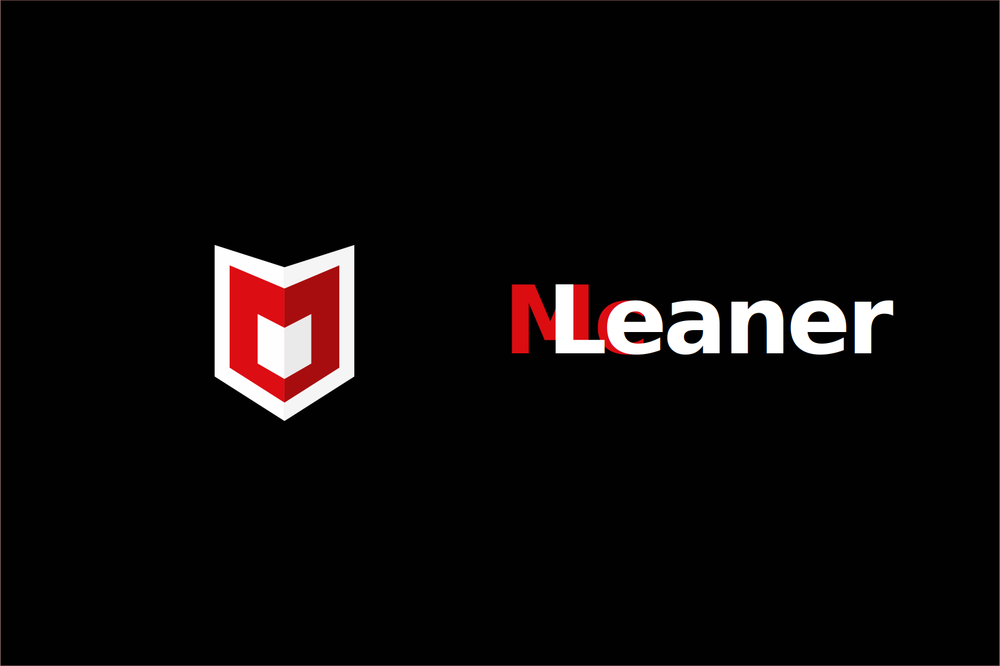

# mc-leaner




[](SECURITY.md)

**mc-leaner** is a safe-by-default macOS cleaner for people who want control, not magic.

It helps you **identify and safely relocate leftover system clutter**—especially launchd orphans and legacy binaries—**without breaking your system**.

No silent actions.  
No “optimization.”  
No deletions.

---

## Philosophy

mc-leaner is built on a simple idea:

> macOS maintenance should be **inspectable, reversible, and boring**.

Most “Mac cleaner” tools are dangerous because they:

- delete things you cannot easily restore
- hide what they are doing
- optimize for speed, not safety

mc-leaner takes the opposite approach:

- everything is opt-in
- everything is explained
- everything can be undone

If you want a button that says *“Clean My Mac”*, this tool is not for you.

If you want to understand what is running on your system—and clean it safely—this is.

---

## What mc-leaner does (current)

### Launchd hygiene

- Scans:
  - `/Library/LaunchAgents`
  - `/Library/LaunchDaemons`
  - `~/Library/LaunchAgents`
- Detects **suspected orphaned or unmanaged** launchd plists by:
  - skipping active `launchctl` jobs
  - skipping known installed apps
  - skipping Homebrew-managed services
  - skipping known security and endpoint software
- Prompts before every action
- Moves files to a **timestamped backup folder** on your Desktop
- Supports `--explain` flag to provide detailed reasoning per item

-### /usr/local/bin inspection
(corresponds to `--mode bins-only`)

- Optionally inspects `/usr/local/bin` for legacy or unmanaged binaries
- Conservative and heuristic-based by design
- Supports `--explain` flag to clarify detection logic

### Cache inspection (v1.1.0)

- Inspects large user-level cache directories only:
  - `~/Library/Caches/*`
  - `~/Library/Containers/*/Data/Library/Caches`
- Reports:
  - cache size
  - last modified time
  - best-effort owning app or bundle identifier
- Groups caches by app for easier review
- `--explain` flag shows top subfolders by size within each cache
- Inspection-first by default (no moves)
- Optional cleanup:
  - requires `--apply`
  - user-confirmed per cache
  - moves caches to backup (never deletes)

#### Example output (inspect mode)

```text
[2026-01-02 14:14:33] Caches: scanned 88 directories; found 2 >= 200MB.

CACHE GROUP: Google
CACHE? 1799MB | modified: 2025-02-03 13:13:57 | owner: Google
  path: ~/Library/Caches/Google
  Subfolders (top 3 by size):
    - 1799MB | Chrome

CACHE GROUP: Homebrew
CACHE? 438MB | modified: 2026-01-02 12:27:04 | owner: Homebrew
  path: ~/Library/Caches/Homebrew
  Subfolders (top 3 by size):
    - 366MB | downloads
    - 46MB  | api
    - 13MB  | bootsnap

Caches: total large caches (by heuristics): 3356MB
```

### Log inspection (v1.2.0)

- Inspects log files and directories exceeding a size threshold (default: 50MB)
- Scans:
  - `~/Library/Logs`
  - `/Library/Logs`
  - `/var/log`
- Reports:
  - size
  - last modified time
  - best-effort owning app or subsystem
- Groups related logs where possible
- `--explain` flag provides:
  - rotation siblings (e.g. `.1`, `.2`, `.gz`)
  - top subfolders by size for large log directories
- Inspection-first by default (no moves)
- Optional cleanup:
  - requires `--apply`
  - user-confirmed per item
  - moves logs to backup (never deletes)
  - system paths may require explicit confirmation and are skipped in non-interactive contexts

### Homebrew hygiene (v1.3.0)

- Inspection-first diagnostics for Homebrew-managed systems
- Intended checks:
  - orphaned formulae and casks
  - unused dependencies
  - outdated or disabled services
  - stale cache and download artifacts
- Read-only by default
- No `brew cleanup`, `brew autoremove`, or destructive commands
- Designed to explain *why* Homebrew reports certain states before suggesting actions

This module will focus on **understanding Homebrew state**, not blindly cleaning it.

### App leftovers inspection (v1.4.0)

- Inspects user-level support locations for leftover data from uninstalled apps
- Scans locations including:
  - `~/Library/Containers`
  - `~/Library/Group Containers`
  - `~/Library/Application Support`
  - `~/Library/Preferences`
  - `~/Library/Saved Application State`
- Uses bundle-id matching against installed apps to avoid false positives
- Skips Apple/system-owned containers and protected software
- Applies a size threshold (default: 50MB) to reduce noise
- Inspection-first by default (no moves)
- Optional cleanup:
  - requires `--apply`
  - user-confirmed per item
  - relocates folders to backup (never deletes)
- Designed for reviewing old app remnants, not active application data

### Architecture reporting

- Generates a report of **Intel-only executables** at:
  - `~/Desktop/intel_binaries.txt`
- Reporting only. No removal.
- Scans common application and support paths for executable files only

---

## What it explicitly does NOT do

- No file deletion
- No app uninstallation
- No modification of app bundles
- No system “optimization”
- No background or automated runs

Every action requires user confirmation.

---

## Safety model

1. **Dry-run by default**  
   Nothing is moved unless you explicitly use `--apply`.

2. **No destructive actions**  
   Files are moved, never deleted.

3. **Hard protection rules**  
   Known security and endpoint tools are always skipped.

4. **User-controlled scope**  
   You decide which modules run.

5. **Always reversible**  
   Restore by moving files back and rebooting.

---

## Requirements

- macOS
- Bash (macOS default supported)
- `launchctl` (built-in)
- `osascript` (optional, for GUI prompts)
- Homebrew (optional, improves detection accuracy)

---

## Global flags

mc-leaner uses a small set of global flags that apply consistently across all modules.

- `--apply`  
  Enables file relocation. Without this flag, mc-leaner runs in **dry-run mode** and performs no changes.

- `--explain`  
  Shows detailed reasoning for why items are flagged or skipped. Strongly recommended before applying any changes.

- `--mode <name>`  
  Runs a single module instead of the default full scan.  
  Examples: `launchd-only`, `caches-only`, `logs-only`, `leftovers-only`, `brew-only`.

- `--help`  
  Prints a short help message with available modes and exits.

**Important:**  
If mc-leaner cannot prompt for confirmation (non-interactive run), cleanup actions are skipped automatically for safety.

---

## Usage

Follow this flow to stay safe and avoid surprises.

1. Clone the repository

```bash
git clone https://github.com/Yvancg/mc-leaner.git
cd mc-leaner
```

2. In your Terminal, run a safe scan first (default: dry-run)

```bash
bash mc-leaner.sh
```

Nothing is moved. This shows what *would* be flagged.

3. Inspect decisions with explanations (optional but recommended)

```bash
bash mc-leaner.sh --explain
```

Use this to understand why items are flagged or skipped.

4. Run one module at a time (recommended)

Examples:

```bash
bash mc-leaner.sh --mode launchd-only --explain
bash mc-leaner.sh --mode caches-only --explain
bash mc-leaner.sh --mode logs-only --explain
bash mc-leaner.sh --mode leftovers-only --explain
bash mc-leaner.sh --mode brew-only
```

5. Apply moves only when you are ready

```bash
bash mc-leaner.sh --mode leftovers-only --apply
```

You will be prompted per item. Files are **moved to a backup folder**, never deleted.

6. Restore if needed

- Open the backup folder created on your Desktop
- Move items back to their original location
- Reboot if the item relates to launchd or system services

**Notes:**

- All modules are inspection-first by default
- If a prompt cannot be shown (non-interactive run), the move is skipped for safety
- See `docs/FAQ.md` for common questions and edge cases

---

## Project structure (designed for expansion)

```text
mc-leaner/
├── mc-leaner.sh
├── modules/
│   ├── launchd.sh        # launchd plist inspection (agents & daemons)
│   ├── bins_usr_local.sh # /usr/local/bin inspection for unmanaged binaries
│   ├── intel.sh          # Intel-only executable reporting (informational)
│   ├── caches.sh         # user-level cache inspection (implemented)
│   ├── brew.sh           # Homebrew hygiene (inspection-only, implemented)
│   ├── leftovers.sh      # app leftovers inspection (implemented)
│   ├── logs.sh           # log inspection (implemented)
│   └── permissions.sh    # planned
├── lib/
│   ├── cli.sh
│   ├── ui.sh
│   ├── fs.sh
│   ├── safety.sh
│   └── utils.sh
├── config/
│   ├── protected-labels.conf   # security & never-touch rules (future)
│   └── modes.conf              # mode → module mapping (future)
├── docs/
│   ├── FAQ.md
│   ├── SAFETY.md
│   └── ROADMAP.md
├── assets/
│   └── social-preview.png
├── CONTRIBUTING.md
├── CODING_STANDARDS.md
├── README.md
└── LICENSE
```

---

## Roadmap (high level)

Future modules focus on **visibility first, cleanup second**:

- App uninstall leftovers
- Privacy and permissions audit

No auto-clean. No silent behavior.
See `docs/ROADMAP.md` for detailed planning.

---

## Disclaimer

This software is provided “as is”, without warranty of any kind.  
You are responsible for reviewing and approving every action.
